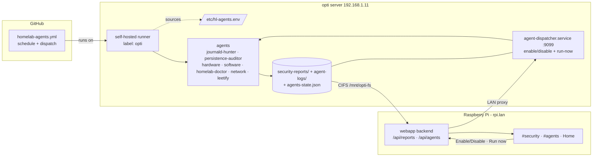

# Homelab Technical Reference

---

## Table of Contents

1. [Network Topology](#1-network-topology)
2. [Hardware](#2-hardware)
3. [Raspberry Pi — OS & Base Config](#3-raspberry-pi--os--base-config)
4. [Docker Stack Overview](#4-docker-stack-overview)
5. [Pi-hole — DNS & DHCP](#5-pi-hole--dns--dhcp)
6. [WireGuard — VPN (decommissioned)](#6-wireguard--vpn-decommissioned)
7. [Vaultwarden + Nginx — Password Manager](#7-vaultwarden--nginx--password-manager)
8. [MariaDB — Vaultwarden Database](#8-mariadb--vaultwarden-database)
9. [Samba — File Server](#9-samba--file-server)
10. [Storage — mergerfs + NFS](#10-storage--mergerfs--nfs)
11. [CI/CD — GitHub Actions Runner](#11-cicd--github-actions-runner)
12. [Log Management](#12-log-management)
13. [Useful Commands & Diagnostics](#13-useful-commands--diagnostics)
14. [WireGuard Peer Manager — Web UI (decommissioned)](#14-wireguard-peer-manager--web-ui-decommissioned)
15. [Homelab Agent Platform](#15-homelab-agent-platform)
16. [YAMS Media Stack (noblenumbat)](#16-yams-media-stack-noblenumbat)
17. [Remote Access](#17-remote-access)
18. [Daily Maintenance — auto-update & reboot](#18-daily-maintenance--auto-update--reboot)

---

## 1. Network Topology

**Host roles, at a glance:**
- **opti** — FS/storage (OpenMediaVault, mergerfs pool, Samba/CIFS server for the whole homelab)
- **noblenumbat** — YAMS media operation (Jellyfin + arr stack + qBittorrent/VPN)
- **rpi** — DNS & webapp (Pi-hole, Vaultwarden, the homelab dashboard webapp)

```
Internet
    |
Router / Gateway — 192.168.1.1
    |
    LAN: 192.168.1.0/24
    |
    ├── rpi.lan          192.168.1.10   Raspberry Pi 4 — DNS & webapp (Pi-hole, Vaultwarden)
    ├── noblenumbat.lan  192.168.1.6    Dell Latitude 7400 — YAMS media operation
    └── opti.lan         192.168.1.11   Custom x86 tower — FS/storage (OpenMediaVault, agent orchestration, Samba \\opti\fs)
```

**No VPN currently exists.** WireGuard (§6) and its peer-manager web UI (§14) were both
decommissioned at some point — the containers, `wg0` interface, and API are all gone
(confirmed 2026-07-11: no `wg0`, nothing on UDP 51820, no `/api/peers` route in the current
webapp). Off-LAN peer configs (`/srv/docker/compose/data/wireguard*` on rpi) are still
sitting on disk, orphaned. **There is currently no way to reach this LAN from outside it.**
Remote access today (§17) is LAN-only: SSH + RDP on opti/noblenumbat, SSH-only on rpi.

**DNS:** Pi-hole at `192.168.1.10:53` handles all LAN DNS. Upstream: `192.168.1.1` (router) + `1.1.1.1` (Cloudflare fallback).

**DHCP:** Pi-hole serves DHCP for `192.168.1.0/24`. Router DHCP should be disabled.

**Local hostnames used in stack:**
- `rpi.lan` → `192.168.1.10`
- `bitwarden.rpi.lan` → `192.168.1.10` (Pi-hole local DNS record)
- `webapp.rpi.lan` → `192.168.1.10` (Pi-hole local DNS record, homelab dashboard)
- `noblenumbat.lan` → `192.168.1.6`
- `jellyfin.lan` → `192.168.1.6` (YAMS/Jellyfin media server)
- `comics.lan` → `192.168.1.6` (Kavita comic/book reader, port 5000)
- `opti.lan` → `192.168.1.11`

---

## 2. Hardware

### Raspberry Pi 4 (`rpi.lan`)

| Field | Value |
|---|---|
| CPU | Cortex-A72 · 4c/4t · 1.8 GHz max |
| RAM | 3.7 GB · no swap |
| Disk | 119 GB SD card · 74 GB free · `/dev/mmcblk0p2` |
| Network | `eth0` wired · `wlan0` off |
| OS | Ubuntu Server |
| IP | `192.168.1.10` (static) |

### noblenumbat (`noblenumbat.lan` / `192.168.1.6`)

| Field | Value |
|---|---|
| Model | Dell Latitude 7400 |
| CPU | i7-8665U · 4c/8t · 4.8 GHz boost · VT-x · Intel UHD 620 (QuickSync H.264 VAAPI) |
| RAM | 16 GB DDR4 2667 MT/s |
| Disk | 512 GB NVMe · SK Hynix PC611 · ~389 GB free |
| GPU | `/dev/dri/renderD128` · render gid **992** |
| Network | Intel Wireless-AC · WiFi only (`wlo1`) |
| OS | Ubuntu 24.04.4 |
| IP | `192.168.1.6` (DHCP) |
| Role | YAMS media stack · suspend disabled (`sudo systemctl mask sleep.target suspend.target hibernate.target hybrid-sleep.target`) |

### opti (`opti.lan` / `192.168.1.11`)

| Field | Value |
|---|---|
| CPU | i5-3570 · 4c/4t · 3.4 GHz · Intel HD 2500 (QuickSync H.264) |
| RAM | 5.7 GB |
| Disk | 457 GB root · mergerfs pool `/srv/pool` (~1.1 TB, ~858 GB free) |
| GPU | `/dev/dri/renderD128` · render gid **106** |
| OS | Debian 12 (Bookworm) |
| IP | `192.168.1.11` (DHCP) |
| Role | **OpenMediaVault** NAS · Samba share `\\opti\fs` = `/srv/pool` · homelab agent orchestration · self-hosted GitHub Actions runner (`label: opti`) |

**opti storage map:**
```
/srv/pool/               ← OMV mergerfs pool (~1.1 TB total)
  ptm/
    Media/Movies/        ← Jellyfin MOVIE LIBRARY (primary storage; noblenumbat mounts at /mnt/opti-library)
    Media-Import/        ← file-drop inbox for Jellyfin (\\opti\fs\ptm\Media-Import\)
    security-reports/    ← security agent reports (Pi mounts as /mnt/opti-fs/ptm/security-reports)
    agent-logs/          ← homelab agent logs
    certs/               ← TLS certs for webapp
```

**Note:** OMV manages Samba config on opti — do NOT hand-edit it directly.

**NFS:** removed 2026-07-11. `nfs-kernel-server` (plus `rpcbind`/`rpc-statd`) was installed
and running on opti but exported nothing — `/etc/exports` was empty, and the fstab entry
for mounting noblenumbat's export was commented out and never finished. All cross-host
storage sharing runs on Samba/CIFS instead (see §10). Disabled and removed rather than
left idle, to shrink unused attack surface.

---

## 3. Raspberry Pi — OS & Base Config

**Docker:** Docker Engine + Compose plugin. Stack file lives at `/srv/docker/compose/docker-compose.yml`. This path is the canonical runtime location — the repo file is pushed here by CI.

**Key paths:**
```
/srv/docker/compose/docker-compose.yml   # live compose file (deployed by CI)
/srv/docker/compose/certs/               # TLS certs for nginx/bitwarden
/srv/docker/compose/nginx.conf           # nginx reverse proxy config
/srv/docker/compose/bitwarden-db/data/   # MariaDB data (bind mount)
/srv/docker/compose/vaultwarden-data/    # Vaultwarden data (bind mount)
/srv/docker/compose/data/wireguard*/      # orphaned WireGuard config — service decommissioned, see §6
/mnt/opti-fs/                            # CIFS mount of \\opti\fs — the real shared storage (see §10)
/mnt/opti-fs/ptm/logging/                # Deploy & stack logs
/mnt/opti-fs/ptm/security-reports/       # Security agent reports (see §15)
/mnt/opti-fs/ptm/agent-logs/             # Homelab agent reports (see §15)
/mnt/workstation-agent-logs/             # CIFS mount from tux (192.168.1.3), read-only
```

**Manage Docker stack:**
```bash
cd /srv/docker/compose
docker compose ps
docker compose up -d --remove-orphans
docker compose down
docker compose pull
docker compose logs -f [service]
docker compose restart [service]
```

---

## 4. Docker Stack Overview

Stack at `/srv/docker/compose/docker-compose.yml`. All services use the shared `json-file` logging driver (max-size: 10m, max-file: 5).

| Container | Image | Network | Ports |
|---|---|---|---|
| `pihole` | `pihole/pihole:latest` | host | :53 (DNS/UDP+TCP), :67 (DHCP), :80/:443 (web UI) |
| `nginx-bitwarden` | `nginx:stable-alpine` | internal bridge | `443:443` |
| `bitwarden` | `vaultwarden/server:latest` | internal bridge | :80 (internal only) |
| `bitwarden-db` | `mariadb:11` | internal bridge | :3306 (internal only) |
| `webapp` | `node:lts-alpine` | internal bridge | :3000 (internal only) — homelab dashboard backend (§15) |
| `nginx-webapp` | `nginx:stable-alpine` | internal bridge | `192.168.1.10:8443:443` |
| `notes-api` | (compose build) | internal bridge | `192.168.1.10:3002:3002` |

Decommissioned, no longer present: `wireguard` (§6), `samba`/`dperson-samba` (§9),
`wg-manager` + `nginx-wgmgr` — the latter two were replaced in place by `webapp` +
`nginx-webapp` (same port 8443, repurposed from WireGuard peer management to the homelab
agents/reports dashboard — see §15).

**Docker network `internal`:** Bridge network isolating Nginx, Vaultwarden, and MariaDB from the host. Only Nginx is reachable from outside (via port 443).

**Restart policy:** All containers: `unless-stopped`.

---

## 5. Pi-hole — DNS & DHCP

**Mode:** `network_mode: host` — required for DHCP broadcast reception and raw DNS port binding.

**Web UI:** `http://192.168.1.10/admin` (or `http://rpi.lan/admin`)

**Key env vars (no password here):**
```yaml
TZ: "America/New_York"
FTLCONF_dns_upstreams: "192.168.1.1;1.1.1.1"
```

**Volumes:**
- `pihole_data` → `/etc/pihole` (block lists, config, local DNS records)
- `dnsmasq_data` → `/etc/dnsmasq.d` (DHCP config, additional DNS options)

**Capabilities:** `NET_ADMIN` (DHCP), `SYS_NICE` (suppresses FTL priority warning)

**Adding a local DNS record** (for custom LAN hostnames like `bitwarden.rpi.lan`):
Pi-hole web UI → Local DNS → DNS Records → add `bitwarden.rpi.lan` → `192.168.1.10`

Or edit via volume: `pihole_data` → `/etc/pihole/custom.list`:
```
192.168.1.10 bitwarden.rpi.lan
192.168.1.10 vpn.rpi.lan
```

**Debug DNS:**
```bash
docker exec pihole pihole -t            # live query log
docker exec pihole pihole status
docker exec pihole pihole restartdns
```

**FTL logs:**
```bash
docker logs pihole --tail=100 -f
```

---

## 6. WireGuard — VPN (decommissioned)

**Decommissioned — confirmed gone 2026-07-11.** No `wireguard` container, no `wg0`
interface, nothing listening on UDP 51820. This section originally documented a
`linuxserver/wireguard` container (5 auto-provisioned peers, `10.8.0.0/24`, `vpn.rpi.lan`)
that no longer exists — kept below for history only, **do not follow it as current state.**

Orphaned config data is still on disk at `/srv/docker/compose/data/wireguard*` on rpi
(never cleaned up). **Practical impact: there is currently no VPN and no off-LAN access
into this homelab at all** — see the note in §1. If WireGuard (or a replacement like
Tailscale) is wanted again, that's a fresh setup, not a restart of anything existing.

<details>
<summary>Original config (historical, non-functional)</summary>

**Image:** `linuxserver/wireguard`

**Config volume:** `./data/wireguard:/config` — peer configs were auto-generated here by the container on first start.

**Key settings:**
```yaml
SERVERURL: vpn.rpi.lan      # DNS name (needs to resolve from the internet for external peers)
SERVERPORT: 51820
PEERS: 5                    # number of client configs to auto-generate
PEERDNS: 192.168.1.10       # VPN clients use Pi-hole for DNS
INTERNAL_SUBNET: 10.8.0.0   # VPN address space (10.8.0.0/24)
PUID/PGID: 1000
```

**Capabilities:** `NET_ADMIN`, `SYS_MODULE` + kernel module volume `/lib/modules:/lib/modules` + sysctl `net.ipv4.conf.all.src_valid_mark=1`

</details>

---

## 7. Vaultwarden + Nginx — Password Manager

### Nginx (`nginx-bitwarden`)

Terminates TLS for `bitwarden.rpi.lan`, proxies to Vaultwarden on the internal bridge.

**Port:** `443:443` (host → container)

**Certs (self-signed / mkcert, not public CA):**
```
./certs/bitwarden.rpi.lan.pem       → /etc/ssl/certs/bitwarden.crt
./certs/bitwarden.rpi.lan-key.pem   → /etc/ssl/private/bitwarden.key
```

**Config:** `./nginx.conf` → `/etc/nginx/conf.d/default.conf`

Typical nginx config for Vaultwarden (reference):
```nginx
server {
    listen 443 ssl;
    server_name bitwarden.rpi.lan;
    ssl_certificate     /etc/ssl/certs/bitwarden.crt;
    ssl_certificate_key /etc/ssl/private/bitwarden.key;
    location / {
        proxy_pass http://bitwarden:80;
        proxy_set_header Host $host;
        proxy_set_header X-Real-IP $remote_addr;
        proxy_set_header X-Forwarded-For $proxy_add_x_forwarded_for;
        proxy_set_header X-Forwarded-Proto $scheme;
    }
    location /notifications/hub {
        proxy_pass http://bitwarden:3012;
        proxy_http_version 1.1;
        proxy_set_header Upgrade $http_upgrade;
        proxy_set_header Connection "upgrade";
    }
}
```

### Vaultwarden

**Image:** `vaultwarden/server:latest`

**Access:** `https://bitwarden.rpi.lan` (LAN only — not public facing)

**Data volume:** `./vaultwarden-data:/data` (bind mount — contains the SQLite fallback data directory, though MariaDB is used)

**Key env vars:**
```yaml
DATABASE_URL: "mysql://bitwarden:<pass>@bitwarden-db:3306/bitwarden"
DOMAIN: "https://bitwarden.rpi.lan"
WEBSOCKET_ENABLED: "true"
SIGNUPS_ALLOWED: "true"
```

Admin panel: `https://bitwarden.rpi.lan/admin` (requires `ADMIN_TOKEN`)

**Network:** Internal bridge only — no direct host port exposure. Only reachable through Nginx.

**Debug:**
```bash
docker logs bitwarden --tail=100
docker exec -it bitwarden /bin/sh
```

---

## 8. MariaDB — Vaultwarden Database

**Image:** `mariadb:11`
**Container name:** `bitwarden-db`
**Data:** `./bitwarden-db/data:/var/lib/mysql` (bind mount)
**Network:** `internal` bridge (not exposed to host)
**`stop_grace_period: 60s`** — prevents SIGKILL on deploy, which corrupts `tc.log`.

**Database:** `bitwarden` · user: `bitwarden`

**tc.log note:** If MariaDB fails to start with a `tc.log` corruption error, it was SIGKILL'd mid-transaction. Fix:
```bash
docker run --rm -v /srv/docker/compose/bitwarden-db/data:/var/lib/mysql \
  mariadb:11 mysqld --tc-heuristic-recover=ROLLBACK
```
Or simply delete `tc.log` from the data directory if no in-flight transactions were critical.

**Connect from host (for debugging):**
```bash
docker exec -it bitwarden-db mysql -u bitwarden -p bitwarden
```

**Backup:**
```bash
docker exec bitwarden-db mysqldump -u bitwarden -p bitwarden > ~/bitwarden-backup-$(date +%Y%m%d).sql
```

---

## 9. Samba — File Server

**Decommissioned.** rpi used to run its own `dperson/samba` container serving a local
`/srv/fs-merged` mergerfs pool (local SD card + NFS from noblenumbat) as `\\rpi.lan\FS`.
That entire architecture was replaced by opti's centralized Samba/mergerfs setup — rpi
runs no Samba server today (confirmed: no `samba` container in `docker ps`, `/srv/fs-merged`
doesn't exist). **The real, current Samba file server is on opti** — see §2 (`\\opti\fs`)
and §10 for the full storage architecture. This section is kept only so the history isn't
lost; don't follow its old paths.

**Healthcheck:** `smbclient -L \\localhost -U % -m SMB3` every 60s

**Logging subdirectory** (on opti's share, not rpi's local Samba):
- `\\opti.lan\fs\ptm\logging` → `/mnt/opti-fs/ptm/logging/` on rpi — deploy and stack logs land here, accessible from Windows.

**Debug:**
```bash
docker exec samba smbstatus
docker logs samba --tail=50
```

---

## 10. Storage — mergerfs + Samba/CIFS

### Architecture

**opti is the single source of truth for shared storage.** An OMV-managed mergerfs pool
on opti unifies its local disk(s), and everything else in the homelab reaches it over
Samba/CIFS — there is no NFS anywhere in this stack (see §2 "NFS: removed 2026-07-11" for
why; a partial NFS setup was planned early on and never finished, so it's been fully
removed rather than left as unused surface).

```
opti — /srv/pool/                    ← OMV mergerfs pool (~1.1 TB total)
  ptm/
    Media/Movies/, Media/Shows/      ← Jellyfin library (noblenumbat mounts these)
    Media-Import/                    ← file-drop inbox
    security-reports/, agent-logs/   ← homelab agent reports
    certs/, logging/, repo/, ...

    │  Samba (\\opti\fs)
    ▼
  ├── rpi        mounts the whole share at /mnt/opti-fs
  └── noblenumbat mounts specific subfolders: /mnt/opti-library, /mnt/opti-shows,
                  /mnt/opti-media (see §16 storage layout)
```

### mergerfs (on opti)

**Check pool status:**
```bash
df -h /srv/pool
ls /srv/pool
```

**Check policy** (mergerfs uses `ff` / `mfs` / `lfs` etc. for placement — check `/etc/fstab` or systemd unit for the mount options):
```bash
cat /proc/mounts | grep mergerfs
```

### CIFS mounts (client side)

Every mount uses `_netdev,nofail` (or `x-systemd.automount` on noblenumbat) so a slow or
down opti never hangs a client's boot — the mount just fails/degrades gracefully and
`mount -a` (or the automount trigger) picks it back up once opti's reachable again.

**rpi** (`/etc/fstab`):
```fstab
//192.168.1.11/fs  /mnt/opti-fs  cifs  credentials=/etc/opti-creds,uid=1000,gid=1003,_netdev,nofail,iocharset=utf8,vers=3.0  0  0
```

**noblenumbat** (`/etc/fstab`, three separate sub-mounts):
```fstab
//192.168.1.11/fs/ptm/Media-Import  /mnt/opti-media    cifs  credentials=/root/.smb-opti,...,_netdev,nofail,x-systemd.automount  0  0
//192.168.1.11/fs/ptm/Media/Movies  /mnt/opti-library  cifs  credentials=/root/.smb-opti,...,_netdev,nofail,x-systemd.automount  0  0
//192.168.1.11/fs/ptm/Media/Shows   /mnt/opti-shows    cifs  credentials=/root/.smb-opti,...,_netdev,nofail,x-systemd.automount  0  0
```

**Verify a mount:**
```bash
mountpoint /mnt/opti-fs        # or /mnt/opti-library, etc.
df -h /mnt/opti-fs
```

**If a mount drops:** re-mount with `sudo mount -a`. If that fails with a connection error
immediately after opti was rebooted or its network changed, give opti a minute to finish
starting Samba (`smbd`), then retry.

---

## 11. CI/CD — GitHub Actions Runner

### How it works

The Pi runs a self-hosted GitHub Actions runner process that **polls** GitHub's API over HTTPS (no inbound ports needed). When a push to `main` modifies `Peters Spellbook/RPI/docker-compose.yml`, the workflow triggers and the runner picks it up.

**Workflow file:** `.github/workflows/rpi-deploy.yml`

**Job steps:**
1. `actions/checkout@v4` — clone/update repo on Pi
2. `cp "Peters Spellbook/RPI/docker-compose.yml" /srv/docker/compose/docker-compose.yml` — deploy compose file
3. `docker compose pull` — pull latest images
4. `docker compose up -d --remove-orphans` — bring stack up, remove stale containers
5. `docker compose logs --tail=200` (if: always) — capture startup logs → `/mnt/opti-fs/ptm/logging/deploy-<timestamp>.log`

**Timeout:** 10 minutes. **Trigger:** also supports `workflow_dispatch` for manual runs from GitHub UI.

### Runner management

**Check runner status:**
```bash
# Find the runner service (usually installed as a systemd service)
systemctl list-units --type=service | grep actions
systemctl status actions.runner.*

# Runner working directory (default install)
ls ~/actions-runner/
```

**Runner logs:**
```bash
ls ~/actions-runner/_diag/
tail -f ~/actions-runner/_diag/Runner_*.log
```

**Re-register runner** (if token expires):
```bash
cd ~/actions-runner
./config.sh remove --token <token>
./config.sh --url https://github.com/<user>/<repo> --token <new-token>
```

---

## 12. Log Management

### Deploy logs (per-deploy snapshot)

**Location:** `/mnt/opti-fs/ptm/logging/deploy-YYYYMMDD-HHMMSS.log`
**Created by:** Step 5 of the CI workflow (`docker compose logs --tail=200`)
**Windows path:** `\\opti.lan\fs\ptm\logging\`
**Logrotate:** 10 rotations × 5 MB max = 50 MB total

### Stack log (continuous live stream)

**Location:** `/mnt/opti-fs/ptm/logging/stack.log`
**Created by:** `docker-stack-logs.service` (systemd) — streams `docker compose logs -f` continuously
**Logrotate:** 5 rotations × 20 MB max = 100 MB total (uses `copytruncate`)

**Live tail:**
```bash
tail -f /mnt/opti-fs/ptm/logging/stack.log
```

**From Windows:** open `\\opti.lan\fs\ptm\logging\stack.log` in a text editor that supports live reload.

**Service management:**
```bash
systemctl status docker-stack-logs
systemctl restart docker-stack-logs
journalctl -u docker-stack-logs -f
```

### Timestamps

All Pi and container logs are in **UTC**. Pi is in `America/New_York` (UTC-4 EDT / UTC-5 EST). Convert:
- UTC 05:00 → EDT 01:00 (1 AM local)
- UTC 12:00 → EDT 08:00 (8 AM local)

**Set up once** (already done via `setup-logs.sh`):
```bash
sudo bash "Peters Spellbook/RPI/setup-logs.sh"
```

### Container-level logs

```bash
docker logs <container> --tail=200 -f
docker logs pihole --since 1h
docker logs bitwarden-db --since 30m
```

---

## 13. Useful Commands & Diagnostics

### Stack health

```bash
docker compose ps -a                     # all containers + status
docker stats --no-stream                 # snapshot resource usage
docker system df                         # disk usage by images/volumes
```

### Full redeploy from scratch

```bash
cd /srv/docker/compose
docker compose down
docker compose pull
docker compose up -d
```

### Clear stopped containers / unused images

```bash
docker container prune -f
docker image prune -f
docker volume prune -f                   # careful: only removes volumes not in use
```

### Check what's listening on the host

```bash
ss -tlnp
ss -ulnp                                 # UDP (for DNS :53)
```

### Pi system

```bash
# Temperature
vcgencmd measure_temp

# Memory
free -h

# Disk
df -h

# CPU load
uptime
top

# SD card health (periodic check)
sudo smartctl -a /dev/mmcblk0 2>/dev/null || echo "smartctl not supported on SD"
```

### Network diagnostics

```bash
# Verify DNS is serving from Pi-hole
nslookup google.com 192.168.1.10
dig @192.168.1.10 bitwarden.rpi.lan

# Check Pi-hole is listening
ss -tlnp | grep 53
ss -ulnp | grep 53

# Samba reachability (on opti — the real Samba server, see §9/§10)
smbclient -L \\\\192.168.1.11 -U ptm -m SMB3
```

### CIFS troubleshooting

```bash
# On any client (rpi, noblenumbat) — check if the opti share is mounted
mountpoint -q /mnt/opti-fs && echo "mounted" || echo "NOT mounted"   # rpi
df -h /mnt/opti-fs /mnt/opti-library /mnt/opti-shows /mnt/opti-media 2>/dev/null

# Re-mount
sudo mount -a

# On opti — check Samba is up
systemctl status smbd
smbclient -L \\\\localhost -U % -m SMB3
```
(There is no NFS anywhere in this stack — see §10.)

### Vaultwarden / MariaDB

```bash
# DB health
docker exec bitwarden-db mysqladmin -u bitwarden -p ping

# Vaultwarden health
curl -sk https://bitwarden.rpi.lan/alive

# DB size
docker exec bitwarden-db mysql -u bitwarden -p -e \
  "SELECT table_schema, ROUND(SUM(data_length+index_length)/1024/1024,2) AS 'MB' \
   FROM information_schema.tables WHERE table_schema='bitwarden' GROUP BY table_schema;"
```

### Pi-hole

```bash
docker exec pihole pihole status
docker exec pihole pihole -t              # live query log
docker exec pihole pihole updateGravity   # update block lists
docker exec pihole pihole -g              # same as above
```

### Logrotate (manual force)

```bash
sudo logrotate -f /etc/logrotate.d/docker-stack
```

---

## 14. WireGuard Peer Manager — Web UI (decommissioned)

**Decommissioned along with WireGuard itself (§6).** This used to be a self-hosted
Node.js/Express + NGINX web UI for managing WireGuard peers at `https://wg.rpi.lan:8443`
(`wg-manager` + `nginx-wgmgr` containers, `wg.rpi.lan.pem` cert, `/api/peers` routes).

**The container slot and port were reused, not left empty:** `wg-manager` → `webapp`,
`nginx-wgmgr` → `nginx-webapp`, same `192.168.1.10:8443`, but repurposed entirely into the
**homelab agents/reports dashboard** — see §15 for what actually lives there today
(`webapp.rpi.lan:8443`, cert `webapp.rpi.lan.pem`, routes are `/api/agents` + `/api/reports`,
nothing WireGuard-related remains in the current codebase).

---

## Quick Reference — Service URLs

| Service | URL | Notes |
|---|---|---|
| Pi-hole web UI | `http://192.168.1.10/admin` | or `http://rpi.lan/admin` |
| Vaultwarden | `https://bitwarden.rpi.lan` | LAN only — self-signed cert |
| Vaultwarden admin | `https://bitwarden.rpi.lan/admin` | requires admin token |
| Samba share (opti) | `\\192.168.1.11\fs` | or `\\opti.lan\fs` · OMV-managed · **the** file share (rpi's old local Samba is decommissioned, see §9) |
| Media drop inbox | `\\opti.lan\fs\ptm\Media-Import\` | drop video files here for Jellyfin auto-import |
| Movie library storage | `\\opti.lan\fs\ptm\Media\Movies\` | primary movie library (served by Jellyfin on noblenumbat) |
| Deploy logs | `\\opti.lan\fs\ptm\logging\` | deploy + stack logs |
| opti RDP | `192.168.1.11:3389` | xrdp, open to LAN (see §17) |
| noblenumbat RDP | `192.168.1.6:3389` | gnome-remote-desktop, scoped to specific IPs (see §17) |
| Cockpit (rpi) | `https://192.168.1.10:9090` | admin web UI |
| Homelab dashboard | `https://webapp.rpi.lan:8443` | LAN only — self-signed cert · agents/reports UI (§15), formerly the WireGuard peer manager (§14) |
| **Jellyfin** | `http://jellyfin.lan:8096` | runs on noblenumbat · user: admin |
| Radarr | `http://192.168.1.6:7878` | noblenumbat · movie manager |
| Sonarr | `http://192.168.1.6:8989` | noblenumbat · TV manager |
| Prowlarr | `http://192.168.1.6:9696` | noblenumbat · indexer manager |
| qBittorrent | `http://192.168.1.6:8081` | noblenumbat · via gluetun VPN · user: admin |
| Bazarr | `http://192.168.1.6:6767` | noblenumbat · subtitle manager |
| Mylar3 | `http://192.168.1.6:8090` | noblenumbat · comic manager |
| Kavita | `http://192.168.1.6:5000` | noblenumbat · comic/book reader (phone-friendly PWA) |
| Portainer | `http://192.168.1.6:9000` | noblenumbat · Docker UI |
| FlareSolverr | `http://192.168.1.6:8191` | noblenumbat · Cloudflare bypass for Prowlarr |

---

## Quick Reference — Key File Paths

| Path | What |
|---|---|
| `/srv/docker/compose/docker-compose.yml` | Live stack compose file |
| `/srv/docker/compose/nginx.conf` | Nginx reverse proxy config |
| `/srv/docker/compose/certs/` | TLS certs for bitwarden.rpi.lan |
| `/srv/docker/compose/bitwarden-db/data/` | MariaDB data directory |
| `/srv/docker/compose/vaultwarden-data/` | Vaultwarden data directory |
| `/srv/docker/compose/data/wireguard*/` | orphaned WireGuard config — service decommissioned, see §6 |
| `/mnt/opti-fs/` | CIFS mount of `\\opti\fs` — the real shared storage (see §10) |
| `/mnt/opti-fs/ptm/logging/` | All homelab logs |
| `~/actions-runner/` | GitHub Actions runner install |
| `/etc/systemd/system/docker-stack-logs.service` | Live log streaming service |
| `/etc/logrotate.d/docker-stack` | Log rotation config |

---

## 15. Homelab Agent Platform

Self-monitoring "agents" are **orchestrated from the opti server** (192.168.1.11) — scheduled by
GitHub Actions on a self-hosted runner, controlled from the webapp via a lightweight dispatcher
service. Nothing depends on the desktop. Setup checklist: `Tools/automation/setup-opti.md`.

The Tier-B homelab agents (`hardware-report`, `software-inventory`, `network-report`, and the
disk/docker half of `homelab-doctor`) gather data **from every box in the homelab** — `opti`,
`rpi` (192.168.1.10) and `noblenumbat` (192.168.1.6) — over SSH. Each host's commands run *on that
host* (including opti, reached via localhost) so reachability/DNS/port checks reflect that box's own
vantage point. The collector reads the host list + key from `HL_HOSTS` / `HL_SSH_KEY` (see
`Tools/homelab/_hosts.py`); it is host-agnostic, so the same command works run from a workstation.
Each report carries a `hosts[]` array the webapp renders per host. If the SSH key is missing the
report fails loudly with a single clear finding rather than silently producing empty data.

### Agents

**Tier A — Security** (→ `security-reports/` → `/api/reports` → webapp `#security`):
| Agent | Report | Purpose |
|---|---|---|
| `journald-hunter` | `journal-hunt-latest.json` | Combs **all** journald logs (every unit/boot) for errors/flags — service failures, OOM, disk/FS/kernel/hardware faults — **plus** security signals (failed/accepted SSH, sudo/su, new users). Combined security + general-health sweep. |
| `persistence-auditor` | `persistence-audit-latest.json` | Baseline+diff of cron, systemd timers/units, autostart, rc/profile files. |

**Tier B — Homelab** (→ `agent-logs/` → `/api/agents` → webapp `#agents`):
| Agent | Report | Purpose |
|---|---|---|
| `hardware-report` | `hardware-latest.json` | Per-host CPU/RAM/disk+SMART/GPU/thermals/uptime/virt across all boxes. |
| `software-inventory` | `software-latest.json` | Per-host package count, pending updates, kernel/service versions, docker. |
| `homelab-doctor` | `homelab-doctor-latest.json` | Network-wide service reachability + TLS cert expiry + report freshness; **per-host** disk + docker. |
| `network-report` | `network-latest.json` | Per-host interfaces, gateway/internet/DNS reachability, listening ports. |

Webapp `#agents` cards are shown in a fixed order — **Homelab Doctor → Hardware → Software →
Network** (set via `order` in the backend `CATALOG`, `routes/agents.js`).

**Leetify** (`leetify-stats` → `leetify-latest.json`) is a non-security CS2-stats agent surfaced on
the webapp **Home** card; dormant unless `LEETIFY_API_KEY` + `STEAM64_ID` are set.

### Control plane

- **Schedule:** `.github/workflows/homelab-agents.yml`, `runs-on: [self-hosted, opti]`. The `opti`
  label keeps it off the Pi deploy runner. `homelab-doctor`+`network` every 30 min; `hardware`,
  `software` + security agents daily. `leetify-stats` and `refresh-cs2-knowledge` make paid Claude
  calls and are **not scheduled** — run them on demand via "Run workflow" (`workflow_dispatch`).
  Because it's on-demand, `leetify-latest.json` is explicitly exempted from staleness checks
  (`MANUAL_ONLY_REPORTS` in `homelab-doctor.py`, `manual: true` in the webapp's `agents.js`
  `CATALOG`) — otherwise every homelab-doctor run flagged it as a false-positive "stale report"
  simply because it hadn't been run recently on purpose.
- **Dispatcher:** `hl-agent-dispatcher.service` on opti (`:9099`) owns `agents-state.json` and runs
  agents on demand from an allowlist. The webapp **Enable/Disable** + **Run now** buttons proxy to
  it over the LAN. Both schedule and run-now honor the enabled flag.
- **Config/secrets:** `/etc/hl-agents.env` on opti (paths + `LEETIFY_API_KEY` + `STEAM64_ID` +
  `HL_DISPATCH_TOKEN` + `HL_HOSTS` + `HL_SSH_KEY`), sourced by both the workflow and the dispatcher
  — secrets never leave opti.
- **Multi-host SSH:** `HL_HOSTS="opti=127.0.0.1,rpi=192.168.1.10,noblenumbat=192.168.1.6"` and
  `HL_SSH_KEY=/path/to/hl_agents` (private key authorized on all three boxes *and* on opti itself).
  Non-interactive `BatchMode` SSH; an unreachable host degrades to an "unreachable" entry, not a
  crash. Generate once: `ssh-keygen -t ed25519 -f ~/.ssh/hl_agents -N ''`, then append the `.pub`
  to each host's `~/.ssh/authorized_keys` (opti included).

### Flow



**Storage map:** opti `…/fs/ptm/{security-reports,agent-logs}` = Pi `/mnt/opti-fs/ptm/...` = webapp
container `/reports` + `/agent-logs`.

---

## 16. YAMS Media Stack (noblenumbat)

Full YAMS installation on noblenumbat (192.168.1.6) — Jellyfin + arr stack + qBittorrent + ProtonVPN.

### Containers

| Container | Image | Port | Notes |
|---|---|---|---|
| `jellyfin` | `lscr.io/linuxserver/jellyfin` | `8096` | Media server · QuickSync VAAPI |
| `radarr` | `lscr.io/linuxserver/radarr` | `7878` | Movie manager · 43 Batman titles added |
| `sonarr` | `lscr.io/linuxserver/sonarr` | `8989` | TV manager |
| `lidarr` | `lscr.io/linuxserver/lidarr` | `8686` | Music manager |
| `prowlarr` | `lscr.io/linuxserver/prowlarr` | `9696` | Indexer manager (no indexers configured) |
| `qbittorrent` | `lscr.io/linuxserver/qbittorrent:4.6.3` | `8081` | Torrent client · routed through gluetun |
| `sabnzbd` | `lscr.io/linuxserver/sabnzbd` | `8080` | Usenet client · unconfigured |
| `bazarr` | `lscr.io/linuxserver/bazarr` | `6767` | Subtitle manager |
| `gluetun` | `qmcgaw/gluetun:v3.41.0` | — | ProtonVPN free tier · Netherlands · OpenVPN |
| `portainer` | `portainer/portainer-ce` | `9000` | Docker management UI |
| `watchtower` | `nickfedor/watchtower` | — | Auto-updates containers |
| `flaresolverr` | `ghcr.io/flaresolverr/flaresolverr` | `8191` | Cloudflare bypass proxy for Prowlarr indexers |
| `mylar3` | `lscr.io/linuxserver/mylar3` | `8090` | Comic manager (arr for comics) · sends torrents to qBittorrent |
| `kavita` | `lscr.io/linuxserver/kavita` | `5000` | Comic/book library + mobile web reader (CBZ/CBR/epub/PDF, OPDS) |

### Storage layout (on noblenumbat)

```
/srv/media/
  music/           ← Lidarr-managed music
  comics/          ← Mylar3-managed comic library (Kavita library root; Kavita also reads books/)
  downloads/
    torrents/      ← qBittorrent save path (LOCAL — torrents never write to the network)
  staging/         ← media-import drop zone → Radarr DownloadedMoviesScan
  blackhole/       ← torrent blackhole (qBittorrent watch folder, fed by media-import.sh)

/mnt/opti-library/ ← MOVIE LIBRARY — CIFS mount of \\opti\fs\ptm\Media\Movies (opti mergerfs pool).
                     Bind-mounted over /data/movies in jellyfin/radarr/bazarr via
                     docker-compose.custom.yaml, so containers still see /data/movies.
                     Radarr imports are cross-device → copy fallback (no hardlinks).
/mnt/opti-shows/   ← TV LIBRARY — CIFS mount of \\opti\fs\ptm\Media\Shows (opti mergerfs pool).
                     Bind-mounted over /data/tvshows in jellyfin/sonarr/bazarr, same pattern as
                     movies. Migrated 2026-07-08 (85 episode files / ~37 GB, diff-verified against
                     source before the local copy was deleted).
/mnt/opti-media/   ← file-drop inbox — CIFS mount of \\opti\fs\ptm\Media-Import

/opt/yams/         ← YAMS install root
  docker-compose.yaml
  docker-compose.custom.yaml  ← QuickSync patch + opti movie/TV library binds + kavita/mylar3
  .env               ← includes COMPOSE_FILE= so both compose files always load
  config/          ← per-service config volumes
```

Movies and TV both live on **opti** (movies moved 2026-07; TV followed 2026-07-08, freeing an
additional ~37 GB). Only comics/music/downloads/staging remain local. Note: on 2026-07-08 the
opti bind-mounts for `jellyfin`/`radarr`/`sonarr`/`bazarr` were found **missing from the live
`docker-compose.custom.yaml`** despite being documented here and present in git — the deployed
file only had the QuickSync patch, meaning new Radarr/Sonarr imports had been silently landing on
local disk for an unknown period before this was caught and redeployed. If storage docs and live
`docker inspect` output disagree again, trust `docker inspect`, not this file, and re-sync
whichever drifted. The `vpn-stack-heal.timer` also enforces a low-disk guardrail: **< 10 GB free
on `/` pauses all torrents** (log: `/var/log/vpn-stack-heal.log`; resume manually in qBittorrent
after freeing space).

### File-drop pipeline

Drop video files **or `.torrent` files** to **`\\opti.lan\fs\ptm\Media-Import\`** from any Windows machine. (noblenumbat runs no SMB server — the drop share is on opti only. `\\opti\fs\ptm\Media\Movies\` is the movie *library* — don't drop files there.)

On noblenumbat: `/mnt/opti-media` is a CIFS mount of that share (fstab, auto-mount). The `media-import.timer` systemd unit runs `/usr/local/bin/media-import.sh` every 2 min:
- **Video files** (mtime-stable ≥2 min) → moved to `/srv/media/staging/` + `Radarr: DownloadedMoviesScan`. Radarr matches, renames, and imports into the movie library on opti (`/data/movies` in-container = `/mnt/opti-library`). Jellyfin picks it up automatically (realtime monitor enabled).
- **`.torrent` files** → moved to `/srv/media/blackhole/`, which qBittorrent watches (`/data/blackhole` in-container, scan_dirs). qBittorrent downloads via the VPN into `/data/downloads/torrents`; Radarr imports completed downloads.

Logs: `/var/log/media-import.log` on noblenumbat.

### Hardware transcoding (QuickSync)

Jellyfin uses Intel UHD 620 (i7-8665U) for VAAPI H.264 transcoding. The custom compose override passes `/dev/dri` and render gid `992` into the container. Configured in Jellyfin Dashboard → Playback → Hardware acceleration: **VAAPI**, device `/dev/dri/renderD128`.

### VPN (Gluetun / ProtonVPN)

qBittorrent and SABnzbd run inside gluetun's network namespace (`network_mode: service:gluetun`). Free tier: Netherlands servers only, no port forwarding. Credentials in `/opt/yams/.env` (`VPN_USER`/`VPN_PASSWORD` = ProtonVPN OpenVPN credentials, not account login).

### FlareSolverr (Cloudflare bypass)

FlareSolverr runs on port `8191` and solves Cloudflare challenges on behalf of Prowlarr. To wire it in Prowlarr:
1. Prowlarr → Settings → Indexers → Add FlareSolverr proxy → URL: `http://flaresolverr:8191`
2. Tag the proxy (e.g. `flaresolverr`), then assign that tag to any Cloudflare-protected indexer (e.g. 1337x).

### Comics arm (Mylar3 + Kavita)

Defined in `docker-compose.custom.yaml` (not the YAMS base compose, so YAMS updates won't clobber it). Mylar3 monitors series and pushes torrents to qBittorrent (via gluetun, same as everything else); completed downloads land in `/srv/media/comics/`, which Kavita serves as a phone-friendly web reader (also covers `/srv/media/books/`).

**Mobile / offline reading (set up 2026-07-12):** Kavita is reachable on LAN at
`http://comics.lan:5000` (Pi-hole record). Comics are read on the Pixel 10 via **Mihon**
with the official Kavita extension (extension repo: `Kareadita/tach-extension` on GitHub;
configured with the per-user OPDS URL from Kavita → User Dashboard → 3rd Party Clients).
Chapters are downloaded in Mihon over home WiFi and read offline anywhere — **no remote
access by design** (no VPN/port forward; Tailscale/WireGuard considered and deliberately
skipped). OPDS is enabled server-side (`EnableOpds` in ServerSetting, verified 2026-07-12).
Progress sync is chapter-level: Mihon marks finished chapters as read back in Kavita.
Caveat: Mihon handles CBZ/CBR only — EPUBs in `books/` still need the Kavita web reader.

One-time wiring (all via UIs):
1. **Mylar3** (`:8090`) → Settings → Web Interface: note the API key. Settings → Download → Torrents: qBittorrent, host `172.60.0.18`, port `8081` (gluetun IP — qBittorrent lives in gluetun's netns), qBittorrent credentials, label/category `comics`. Comic Location: `/data/comics`.
2. **Mylar3 metadata:** requires a free ComicVine API key (comicvine.gamespot.com/api) → Settings → Web Interface → ComicVine API.
3. **Prowlarr** (`:9696`) → Settings → Apps → add **Mylar** → Prowlarr server `http://prowlarr:9696`, Mylar server `http://mylar3:8090`, Mylar3 API key. Indexers with the Comics category sync automatically.
4. **Kavita** (`:5000`) → create admin account on first visit → Add library: type *Comics*, folder `/data/comics` (optionally a second *Books* library at `/data/books`).

Phone reading: open `http://192.168.1.6:5000` in the phone browser → "Add to Home Screen" (PWA, remembers reading position). Native apps connect via OPDS (Kavita → user settings → OPDS URL): Mihon on Android (Kavita extension), Panels/Chunky on iOS. **Off-LAN reading currently isn't possible** — WireGuard (the VPN this used to route through) is decommissioned, see §6.

### What is NOT configured (intentional)

- **Prowlarr indexers:** none added — FlareSolverr is ready to support Cloudflare-protected indexers (e.g. 1337x) once you add them via the Prowlarr UI.
- **SABnzbd:** installed but unconfigured (requires paid Usenet provider).

### Manage stack

```bash
# SSH to noblenumbat (via opti jump or direct if key is authorized)
cd /opt/yams
docker compose -f docker-compose.yaml -f docker-compose.custom.yaml ps
docker compose -f docker-compose.yaml -f docker-compose.custom.yaml up -d
docker compose -f docker-compose.yaml -f docker-compose.custom.yaml logs -f jellyfin

# Or use yams CLI (installed at /usr/local/bin/yams)
yams start
yams stop
yams restart

# Check VPN
docker logs gluetun --tail=20
# Check media importer
systemctl status media-import.timer
journalctl -u media-import.service -n 30
tail -f /var/log/media-import.log
```

### Repo files

```
homelab/noblenumbat-srv/yams/
  docker-compose.yml          ← deployed compose (secrets stripped)
  docker-compose.custom.yml   ← QuickSync overlay
  .env.example
  media-import.sh             ← file-drop importer script
  media-import.service        ← systemd unit
  media-import.timer          ← systemd timer (2 min interval)
```

---

## 17. Remote Access

### SSH

Enabled and reachable on all three servers — opti, rpi, noblenumbat. Standard OpenSSH,
key-based auth. rpi did not have passwordless sudo configured for the automation SSH key
until 2026-07-11 (`/etc/sudoers.d/ptm-nopasswd`, added manually) — opti and noblenumbat
already had it.

### RDP

| Host | Server | Port(s) | Firewall scope |
|---|---|---|---|
| **opti** | xrdp | 3389 (LAN), 3350 (xrdp-sesman, loopback only) | Open to full LAN (`192.168.1.0/24`) — matches opti's existing blanket ufw rule |
| **noblenumbat** | gnome-remote-desktop | 3389 (system daemon) + 3390 (user session) | Scoped via ufw to specific source IPs only: `192.168.1.3`, `.5`, `.6` |
| **rpi** | — none — | — | Intentionally SSH-only. Headless 3.7GB-RAM appliance (Pi-hole/webapp) — not worth the XFCE+xrdp footprint for occasional access. |
| tux (workstation) | — out of scope — | — | Considered during the 2026-07-11 remote-access review and explicitly retracted; not part of the managed fleet. |

Both opti's xrdp and noblenumbat's gnome-remote-desktop predate this doc section — they
were already deployed and working, just undocumented. This section makes them official.

### Other listening services worth knowing about (not remote-access, but adjacent)

These showed up as "unexpected" in `network-report`'s port audit before being whitelisted
(`PER_HOST_EXPECTED_PORTS` in `network-report.py`) — all confirmed benign:

- **opti — wsdd (5357) + LLMNR (5355):** Windows network-browsing helpers so `\\opti\fs`
  shows up in Windows' Network view. Not a security concern on a LAN-only service.
- **noblenumbat — rpcbind (111):** pulled in by `nfs-common`, used for NFS *client* support
  only (nothing on noblenumbat exports anything). Harmless, low-value to remove.
- **noblenumbat — cupsd (631):** loopback-only print system, standard Ubuntu desktop default.
- **rpi — Cockpit (9090):** the standard Debian/Ubuntu web-based admin UI
  (`https://192.168.1.10:9090`). No firewall scoping applied — same treatment as other
  admin UIs like Portainer.

---

## 18. Daily Maintenance — auto-update & reboot

Unattended daily package updates across opti, rpi, and noblenumbat, added 2026-07-11.

### What it does

Two systemd timer/service pairs, identical on all three hosts:

- **`homelab-autoupdate.timer`** — fires daily at **02:00** (±5 min randomized delay so all
  three hosts don't hit apt mirrors simultaneously). Runs `homelab-autoupdate.sh`:
  `apt-get update && apt-get upgrade -y && apt-get autoremove -y`, unattended
  (`DEBIAN_FRONTEND=noninteractive`). Logs to `/var/log/homelab-autoupdate.log`.
- **`homelab-autoreboot.timer`** — fires daily at **03:00**, one hour after the update
  window. Runs `homelab-autoreboot.sh`, which checks for `/var/run/reboot-required` (the
  standard Debian/Ubuntu marker dpkg creates when a kernel/libc/etc. upgrade needs a
  reboot) and **only reboots if that file is present**. Most nights, nothing happens.

This **layers on top of**, not replaces, the stock `unattended-upgrades` +
`apt-daily-upgrade.timer` already active on all three boxes (security-origin packages
only, no auto-reboot by default). The new timers do a full `apt upgrade -y` across all
repos and add the reboot behavior. The overlap between the two systems is harmless — `apt
upgrade` is idempotent.

### Reboot safety

Confirmed safe before this was deployed — see the boot-resilience notes throughout this
doc (`unless-stopped` restart policy on every docker container, `_netdev,nofail` /
`x-systemd.automount` on every CIFS mount, all relevant services `enabled` at boot). A
reboot on any of the three hosts should come back to a fully working state with no manual
intervention.

### Repo files & deployment

```
homelab/Tools/automation/
  homelab-autoupdate.sh        ← apt update + upgrade + autoremove
  homelab-autoupdate.service   ← oneshot, runs the script above
  homelab-autoupdate.timer     ← daily 02:00 (+jitter)
  homelab-autoreboot.sh        ← checks /var/run/reboot-required, reboots if present
  homelab-autoreboot.service   ← oneshot, runs the script above
  homelab-autoreboot.timer     ← daily 03:00
```

Deployed identically to opti, rpi, noblenumbat:
```bash
sudo install -m 755 homelab-autoupdate.sh homelab-autoreboot.sh -t /usr/local/bin/
sudo install -m 644 homelab-autoupdate.service homelab-autoreboot.service \
                     homelab-autoupdate.timer homelab-autoreboot.timer -t /etc/systemd/system/
sudo systemctl daemon-reload
sudo systemctl enable --now homelab-autoupdate.timer homelab-autoreboot.timer
```

**Check status:**
```bash
systemctl list-timers homelab-auto*
tail -f /var/log/homelab-autoupdate.log
```
